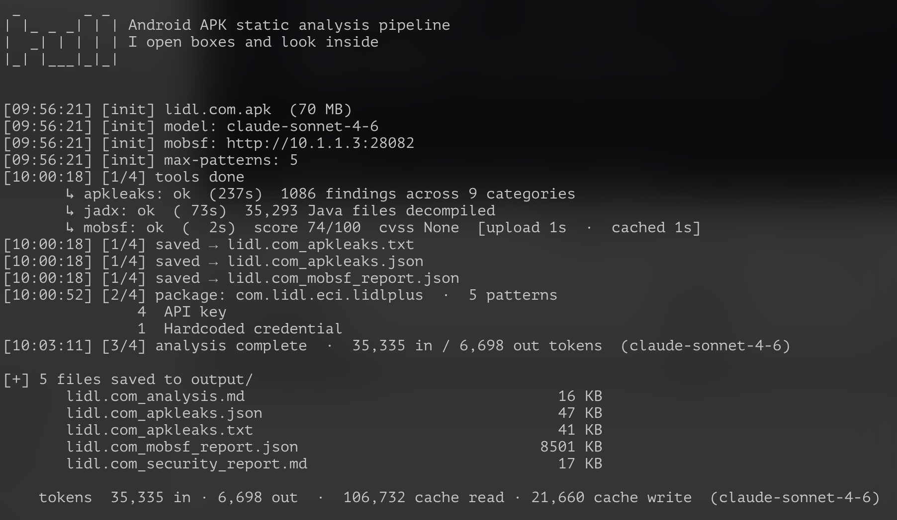
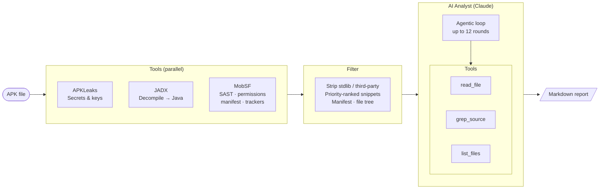

# tull

APK security tools produce useful but noisy output — tracing pattern matches to actually exploitable code still requires reading decompiled source. tull runs APKLeaks, JADX, and MobSF in parallel, then drives a Claude agent to read decompiled Java, confirm or dismiss findings, and write a severity-ranked report. It does not replace a skilled mobile security engineer, but it closes the gap between raw scanner output and a first actionable assessment.

A pipeline that connects three specialist tools through an AI synthesis layer: findings go in, a structured report with code evidence comes out → [example report](example/acme_bank_security_report.md)



---

## Architecture



---

## Prerequisites

| Requirement | Notes |
|---|---|
| Docker | Any recent version |
| `ANTHROPIC_API_KEY` | Set in `.env` or passed via `-e` |
| MobSF | Must be running before tull is invoked — see setup below |
| `MOBSF_URL` | Base URL of your MobSF instance, e.g. `http://10.1.1.3:28082` |
| `MOBSF_API_KEY` | Found in MobSF → Settings → REST API |

---

## Setup

tull needs a running MobSF instance to connect to. Start one first, then point tull at it.

**Option A — bundled MobSF sidecar (docker compose)**

The repo includes a `docker-compose.yml` that runs MobSF as a sidecar. Start it once and leave it running:

```bash
cp .env.example .env
# fill in ANTHROPIC_API_KEY and MOBSF_API_KEY

docker compose up mobsf          # first boot takes ~60 s; wait for "healthy"
```

Then run tull against it (MobSF is reachable at `http://mobsf:8000` inside the compose network):

```bash
mkdir -p input output
cp target.apk input/
docker compose run --no-deps analyzer /data/input/target.apk -o /data/output
```

**Option B — existing MobSF instance**

If you already have MobSF running somewhere (self-hosted, another machine, etc.), just point tull at it:

```bash
docker build -t tull .

docker run --rm \
  -e ANTHROPIC_API_KEY=$ANTHROPIC_API_KEY \
  -e MOBSF_URL=http://<host>:<port> \
  -e MOBSF_API_KEY=$MOBSF_API_KEY \
  -v ./input:/data/input:ro \
  -v ./output:/data/output \
  tull /data/input/target.apk -o /data/output
```

**Option C — Python directly (no Docker)**

```bash
pip install -r requirements.txt   # apkleaks included
# also requires: jadx on PATH

MOBSF_URL=http://... MOBSF_API_KEY=... python analyze.py target.apk -o ./output
```

---

## Usage

```bash
# Use Opus 4.7 for deeper analysis
docker run ... tull target.apk --model claude-opus-4-7

# Cap patterns fed to AI — useful for very large apps, speeds up step 3
docker run ... tull target.apk --max-patterns 150
```

> **Performance note** — decompilation is the slowest step. A 70 MB APK takes roughly
> 5 minutes on an Apple M1 Pro; expect longer on modest server hardware.
> MobSF scan results are cached by file hash, so repeat runs of the same APK are nearly instant.

---

## Output

All files are written to the output directory (default: `output/`):

```
output/
  target_security_report.md   ← final report
  target_apkleaks.txt         ← verbatim APKLeaks output
  target_apkleaks.json        ← APKLeaks findings as JSON
  target_mobsf_report.json    ← full MobSF report JSON
  target_sources/             ← decompiled Java source (app package only)
```

A summary is printed at the end of every run:

```
[+] 4 files saved to output/
       target_security_report.md                         18 KB
       target_apkleaks.txt                               14 KB
       ...

    tokens  42,310 in · 3,891 out  (claude-sonnet-4-6)
```

Report structure:

```
# APK Security Report: AppName

| Field   | Value        |
| File    | target.apk   |
| Package | com.example  |
| SHA256  | …            |
| Risk    | HIGH         |
| Score   | 45/100       |

## Executive Summary
## Findings
   ### 🔴 Critical   [C-01] Hardcoded API key …
   ### 🟠 High       [H-01] WebView JS bridge exposed …
   ### 🟡 Medium     [M-01] ECB cipher mode …
   ### 🟢 Low / Informational
## Attack Surface
   ### Permissions
   ### Exported Components
   ### Network Endpoints
## Recommendations (Priority Order)
## Tool Status
```

Each finding includes severity, category, file path with line number, code evidence, impact, and recommendation. HIGH and CRITICAL findings must be backed by exact code — the analyst is instructed to downgrade rather than speculate.

---

## Options

```
usage: analyze.py [-h] [-o OUTPUT] [--mobsf-url URL] [--mobsf-key KEY]
                  [--model MODEL] [--max-patterns N]
                  apk

positional arguments:
  apk                   Path to APK file

options:
  -o, --output DIR      Report output directory (default: output/)
  --mobsf-url URL       MobSF base URL (env: MOBSF_URL)
  --mobsf-key KEY       MobSF API key (env: MOBSF_API_KEY)
  --model MODEL         claude-sonnet-4-6 | claude-opus-4-7
  --max-patterns N      Cap patterns fed to AI, highest-priority first (0 = no limit)
```

---

## How it works

**APKLeaks** scans the APK for leaked secrets, keys, and tokens using a rule-based pattern library. Output is formatted and passed verbatim to the analyst. Runs in parallel with JADX.

**JADX** decompiles the APK to Java source. The filter stage strips all third-party and standard library packages (Android, AndroidX, Kotlin, OkHttp, Firebase, Retrofit, and ~20 other prefixes), leaving only app-package code.

**MobSF** provides static analysis via REST API: upload → scan → report JSON. The summary passed to the analyst covers security score, CVSS, dangerous permissions, manifest findings, HIGH/WARNING SAST results, discovered URLs, and tracker count. A running MobSF instance with `MOBSF_URL` and `MOBSF_API_KEY` set is required.

**Filter** builds a token-efficient `AppContext`: priority-ranked code snippets (credentials uncapped, URLs capped at 20), filtered file tree, parsed AndroidManifest.xml. Use `--max-patterns` to limit total snippets on very large apps.

**Analyst (Claude)** runs an agentic investigation loop with three tools: `read_file` (read a specific decompiled Java file), `grep_source` (regex search across app sources), `list_files` (directory listing). Claude decides which files to examine based on APKLeaks findings, MobSF issues, and pre-scanned patterns, then writes the final report. Maximum 12 tool-call rounds. Severity is applied strictly — CRITICAL and HIGH require exact file path, line number, and code snippet as evidence.

---

## Security

This tool analyses untrusted input — APK files sourced from unknown parties. The decompiled code and strings extracted from those APKs are fed directly into an AI agent that has file-system tools (`read_file`, `grep_source`, `list_files`). A malicious APK could embed content designed to manipulate the agent's behaviour (a.k.a [indirect prompt injection](https://genai.owasp.org/llmrisk/llm01-prompt-injection/)).

**Running inside the provided Docker container is strongly recommended.** The container limits the blast radius: the agent's file tools are scoped to the temporary JADX working directory, and the container has no access to the host filesystem beyond the explicitly mounted `input/` and `output/` volumes.

Avoid running `python analyze.py` directly on a host that has access to sensitive files or credentials beyond `ANTHROPIC_API_KEY`.

---

## License

MIT — see [LICENSE](LICENSE)
